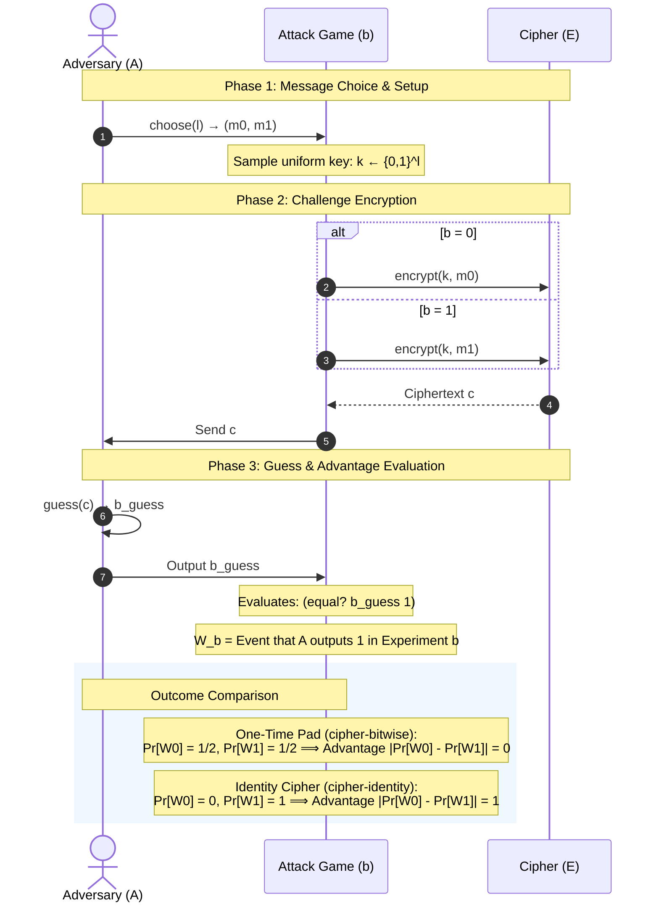

# CryptPP: Cryptography with Probabilistic Programming

## What is CryptPP?
CryptPP is a project that uses the probabilistic programming language [Roulette](https://docs.racket-lang.org/roulette/index.html) to analyze cryptographic proofs.

## Security Games 
### [Semantic Security](semantic_security.rkt)
Semantic Security based on Dan Boneh and Victor Shoup's "A Graduate Course in Applied Cryptography" (2023)

    
## Proof Games
### [Reed-Solomon Fingerprint Protocol](reed_solomon_fingerprint.rkt)
Reed-Solomon Fingerprint Protocol based on Justin Thaler's "Proofs, Arguments, and Zero-Knowledge" (2023)
